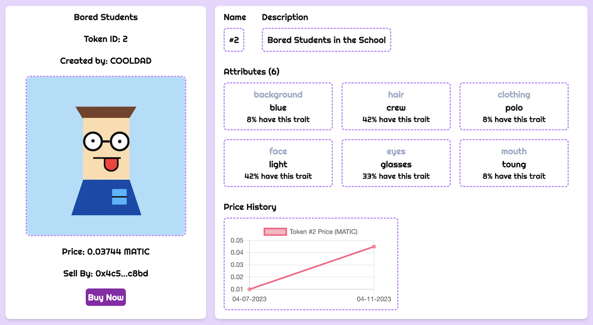
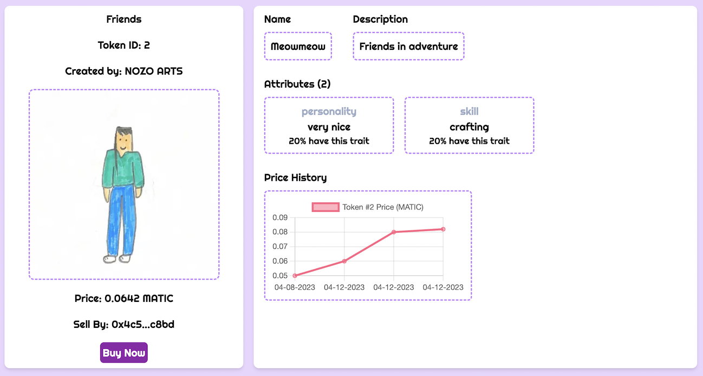

# OURS NFT Marketplace - a Web3 Decentralized NFT market

Buy NFTs (ERC721 tokens) from our boutique collections.

## Tech Stacks and Tools Used

### Backend:

- Development environment: Hardhat
- Language: JavaScript/ NodeJs
- Blockchain: Polygon Mumbai Testnet
- Token Standard: ERC721 using OpenZeppelin
- Smart Contract: Solidity

### Frontend:

- JavaScript/React Library: Next.js
- Styling: Tailwind CSS
- Interacting with the Ethereum Blockchain and its ecosystem: Ethers.js
- Accessing Ethereum: Metamask Browser Wallet

## React Frontend

### 1. Home Page - see our collections:

### 2. Collection Page - see our NFTs in a collection:

### 3. NFT Page - see our NFT and it's data:

### 4. Sell NFT Page - where users 1.approve and list the NFT for sell 2.withdraw sellers' proceeds

### 5. Admin Page - where the market owner creates collection info and withdraws market fees

